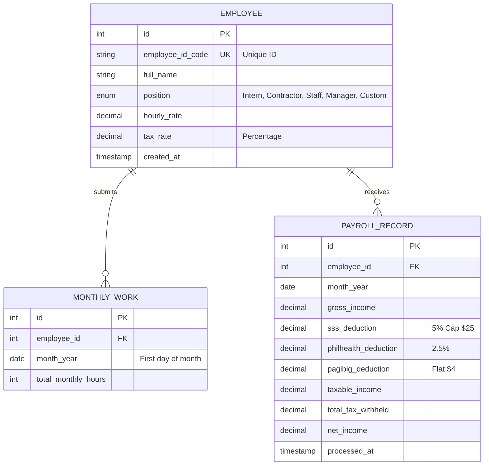

# Project Title: **Automated Payroll & Tax Calculator System**
**Final Project: Lesson 9 - Group 4 Implementation**

---

## 1. Tech Stack Justification

The project uses a modular, multi-tier architecture to ensure scalability, ease of implementation, and data integrity.

| Component | Technology | Justification |
| :--- | :--- | :--- |
| **Database** | **MySQL (InnoDB)** | Essential for **Payment Integrity**. InnoDB supports **ACID transactions**, ensuring that payroll calculations and status updates occur atomically (all-or-nothing). |
| **Web Portal** | **PHP 8.x** | Native compatibility with **XAMPP**. PHP's PDO (PHP Data Objects) extension provides a secure way to interact with MySQL and prevent SQL injection. |
| **Backend Engine** | **Python 3.x** | Chosen for its modularity and ease of integration with external hardware (e.g., RFID listeners) or complex mathematical batch processing. |
| **Frontend UI** | **HTML5 / CSS3 / JS** | Uses **Inter font** and modern CSS Grid/Flexbox for a responsive, professional interface. Vanilla JavaScript handles **Phase 1-4 logic** and prevents negative inputs. |

---

## 2. Enhanced Entity-Relationship Diagram (EERD)



---

## 3. Data Dictionary

### **Table: employees**
Stores configuration data for each employee (Phase 1).

| Field | Data Type | Constraints | Description |
| :--- | :--- | :--- | :--- |
| `id` | INT | PK, AI | Internal unique identifier. |
| `employee_id_code` | VARCHAR(50) | UNIQUE, NOT NULL | User-defined employee ID. |
| `full_name` | VARCHAR(100) | NOT NULL | Complete name of the employee. |
| `position` | ENUM | NOT NULL | Intern, Contractor, Regular Staff, Manager, Custom. |
| `hourly_rate` | DECIMAL(10,2) | NOT NULL | Pay per hour. |
| `tax_rate` | DECIMAL(5,2) | NOT NULL | Tax percentage based on position. |

### **Table: payroll_records**
Stores the final output of the Calculation Waterfall (Phase 3 & 4).

| Field | Data Type | Constraints | Description |
| :--- | :--- | :--- | :--- |
| `gross_income` | DECIMAL(10,2) | NOT NULL | Hours × Rate. |
| `sss_deduction` | DECIMAL(10,2) | NOT NULL | 5% of Gross (Max $25). |
| `philhealth_deduction`| DECIMAL(10,2) | NOT NULL | 2.5% of Gross. |
| `pagibig_deduction` | DECIMAL(10,2) | NOT NULL | Flat $4.00. |
| `taxable_income` | DECIMAL(10,2) | NOT NULL | Gross - (SSS + PH + PI). |
| `total_tax_withheld` | DECIMAL(10,2) | NOT NULL | Taxable × Tax Rate. |
| `net_income` | DECIMAL(10,2) | NOT NULL | Final Take-Home Pay. |

---

## 4. Initial SQL Script

```sql
-- Initial Setup for Automated Payroll System
CREATE DATABASE IF NOT EXISTS payroll_db;
USE payroll_db;

-- Employees Table
CREATE TABLE employees (
    id INT AUTO_INCREMENT PRIMARY KEY,
    employee_id_code VARCHAR(50) UNIQUE NOT NULL,
    full_name VARCHAR(100) NOT NULL,
    position ENUM('Intern', 'Contractor', 'Regular Staff', 'Manager', 'Custom') NOT NULL,
    hourly_rate DECIMAL(10, 2) NOT NULL,
    tax_rate DECIMAL(5, 2) NOT NULL,
    created_at TIMESTAMP DEFAULT CURRENT_TIMESTAMP
) ENGINE=InnoDB;

-- Monthly Work Volume
CREATE TABLE monthly_work (
    id INT AUTO_INCREMENT PRIMARY KEY,
    employee_id INT NOT NULL,
    month_year DATE NOT NULL,
    total_monthly_hours INT NOT NULL,
    FOREIGN KEY (employee_id) REFERENCES employees(id) ON DELETE CASCADE
) ENGINE=InnoDB;

-- Payroll Calculation Records
CREATE TABLE payroll_records (
    id INT AUTO_INCREMENT PRIMARY KEY,
    employee_id INT NOT NULL,
    month_year DATE NOT NULL,
    gross_income DECIMAL(10, 2) NOT NULL,
    sss_deduction DECIMAL(10, 2) NOT NULL,
    philhealth_deduction DECIMAL(10, 2) NOT NULL,
    pagibig_deduction DECIMAL(10, 2) NOT NULL,
    taxable_income DECIMAL(10, 2) NOT NULL,
    total_tax_withheld DECIMAL(10, 2) NOT NULL,
    net_income DECIMAL(10, 2) NOT NULL,
    processed_at TIMESTAMP DEFAULT CURRENT_TIMESTAMP,
    FOREIGN KEY (employee_id) REFERENCES employees(id) ON DELETE CASCADE
) ENGINE=InnoDB;
```
